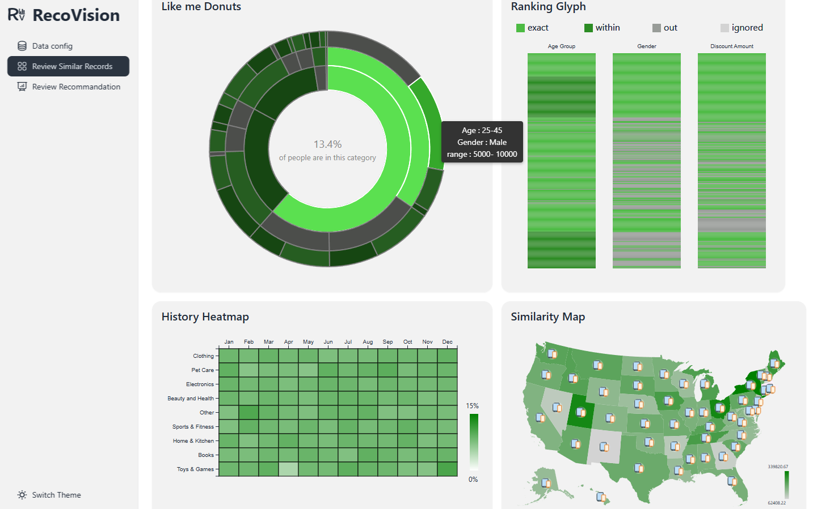

# RecoVision

An interactive visualization of a recommendation system for brand expansion or decision making.

## Prerequisites

- [nodejs](https://nodejs.org/en) for building and execution environment
- [pnpm](https://pnpm.io/installation) as the package manager

## Setup

1. clone repo from main branch
2. run `pnpm install` in the root directory of this repo
3. run `pnpm run dev` to start development server and `ctrl+c` to shut it down

The `pnpm run build` command builds the project for production and outputs a `./dist` directory
where `pnpm run preview` will serve the website from.

## Resources

This section is not required to run the application.

### Framework

- [Sveltekit](https://svelte.dev/docs/kit/introduction)

### UI

- [Tailwindcss](https://tailwindcss.com/docs/utility-first)
- [Daisyui](https://daisyui.com/docs/use/)
- [Heroicons](https://heroicons.com)
- [LucideIcons](https://lucide.dev/icons)
